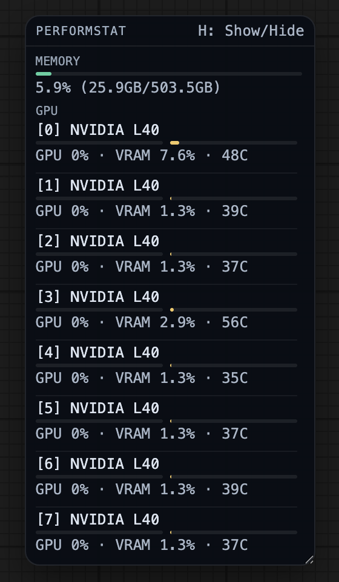

# ComfyUI-performstat

一个用于 ComfyUI 的轻量监控插件，可显示 CPU、内存和 GPU 使用情况。

    
  
## 安装

### 方式一：在 `custom_nodes` 中使用 Git 克隆

```bash
cd ComfyUI/custom_nodes
git clone https://github.com/JHBOY-ha/ComfyUI-performstat.git
cd ComfyUI-performstat
pip install -r requirements.txt
```

然后重启 ComfyUI。

### 方式二：通过 ComfyUI Manager（GitHub URL）安装

1. 打开 **ComfyUI Manager**。  
2. 选择 **Install via Git URL**。  
3. 粘贴仓库地址：`https://github.com/JHBOY-ha/ComfyUI-performstat.git`  
4. 安装完成后重启 ComfyUI。

## 使用说明

添加节点：`Performance Stats (CPU/GPU)`，可将文本输出连接到文本显示节点。

重启后会出现一个紧凑的悬浮监控窗（每 1 秒刷新），并始终置顶。  
你可以用鼠标拖动、缩放悬浮窗，并按 `H` 快速显示/隐藏。

可在 ComfyUI 设置中控制显示项：
- PerformStat: Enable Top Bar
- PerformStat: Show Memory
- PerformStat: Show GPU Usage
- PerformStat: Show VRAM Usage
- PerformStat: Show GPU Temperature
- PerformStat: Show GPU [index] <name>（启动扫描后自动生成）

## 说明

- NVIDIA GPU 监控通过 `pynvml`（NVML）获取。  
- 若 NVML 不可用，会自动回退到 torch CUDA 内存统计。  
- Apple Silicon 支持 torch MPS 内存指标；GPU 利用率和温度在 macOS 上为尽力获取（best-effort）。  
- Apple Silicon 会附带 `status`（active/idle）状态，避免只显示空值或 N/A。
